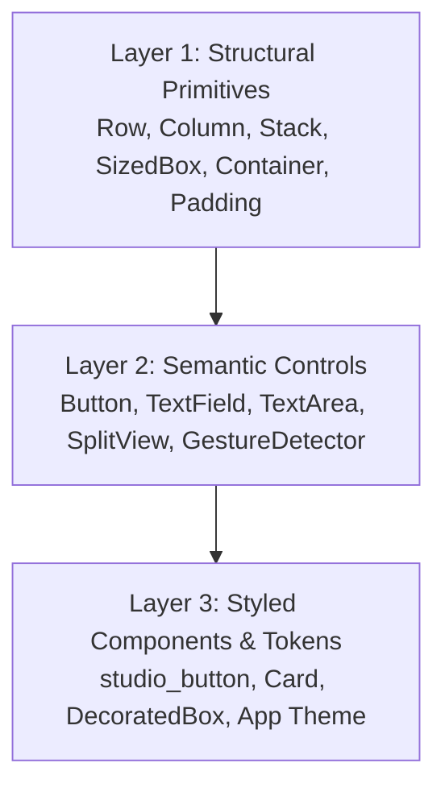

# Incular Core Widget Defaults & Semantic Sizing Architecture

This document establishes the authoritative framework contract for core widget visual neutrality, constraint semantics, and the 3-layer component architecture in Incular.

---

## 1. The Design Law of Neutrality

```text
┌─────────────────────────────────────────────────────────────┐
│ CORE WIDGET                                                 │
│   = behavior + layout + semantics only                      │
├─────────────────────────────────────────────────────────────┤
│ DESIGN SYSTEM / APPLICATION                                 │
│   = colors + padding + shapes + visual states + density     │
└─────────────────────────────────────────────────────────────┘
```

A foundational Incular widget must **never** inject arbitrary visual styling (such as default blue backgrounds, hardcoded padding, or artificial minimum dimensions) unless that styling is an intrinsic property of the widget's semantic specification.

### Key Rules
1. **No Hidden Paint**: Primitive layout widgets (`Row`, `Column`, `Flex`, `Stack`, `Padding`, `Align`, `Center`, `SizedBox`, `ConstrainedBox`, `Container`) and unstyled semantic controls (`Button`, `TextField`, `TextArea`) emit zero extraneous draw commands into the display list when unconfigured or transparent.
2. **Child-Driven Sizing**: Interactive controls like `Button` wrap their children tightly and size strictly based on incoming constraints and child intrinsic dimensions.
3. **No Hardcoded Color Magic**: Default text styles inherit ambient properties. Buttons do not default to framework-selected blues. Text fields do not default to opaque dark grays.

---

## 2. 3-Layer Component Architecture

Incular organizes UI construction into three cleanly separated tiers:



### Layer 1: Structural Primitives
- **Purpose**: Pure geometry, layout constraint propagation, and basic spatial composition.
- **Widgets**: `Row`, `Column`, `Flex`, `Stack`, `Positioned`, `Padding`, `Align`, `Center`, `SizedBox`, `ConstrainedBox`, `Container`, `LimitedBox`, `FittedBox`.
- **Contract**: Zero background paint, zero borders, zero margins unless explicitly supplied. `Container::new()` lowers to `SizedBox::shrink()` (0×0) with zero allocations or paint commands.

### Layer 2: Semantic Controls
- **Purpose**: Interaction handling, keyboard focus, accessibility roles, and state management.
- **Widgets**: `Button`, `TextField`, `TextArea`, `SplitView`, `GestureDetector`, `MouseRegion`, `Focus`.
- **Contract**: Provide full semantic behavior (`SemanticRole::Button`, hover/press state tracking, text editing deltas, caret navigation, hit testing) while remaining visually neutral by default.
  - `Button::new("Save")` is equivalent to `Button::with_child(Text::new("Save"))` with transparent chrome and zero extra padding.
  - `SplitView` separates hit area from visual divider rendering.

### Layer 3: Styled Components & Design System
- **Purpose**: Application branding, density tokens, elevation, themes, and composite controls.
- **Components**: `studio_button`, `studio_icon_button`, `Card`, `DecoratedBox`, `Theme`.
- **Contract**: Owned by application code or high-level component libraries. Composes Layer 1 and Layer 2 primitives to create rich, themed visual controls.

---

## 3. Authoritative Core Defaults Inventory

| Widget | Default Size / Constraints | Default Background | Default Padding | Default Border | Interaction & Semantics |
|---|---|---|---|---|---|
| `Container::new()` | Expands to bounded parent; shrinks to `0 × 0` if unbounded | `None` (no paint) | `EdgeInsets::ZERO` | `None` | Structural grouping |
| `Container::with_child(c)` | Sizes to child clamped to constraints | `None` (no paint) | `EdgeInsets::ZERO` | `None` | Passthrough wrapper |
| `SizedBox::new()` | `0 × 0` or specified `width`/`height` | `None` (no paint) | `EdgeInsets::ZERO` | `None` | Layout constraint |
| `Button::new(label)` | Natural size of label text | `Color::TRANSPARENT` | `EdgeInsets::ZERO` | `None` | `SemanticRole::Button`, click/hover callbacks |
| `Button::with_child(child)` | Natural size of child | `Color::TRANSPARENT` | `EdgeInsets::ZERO` | `None` | `SemanticRole::Button`, click/hover callbacks |
| `TextField::new(ctrl)` | Width: available / 260px; Height: text line height + 16px | `None` (transparent) | `EdgeInsets::ZERO` | Focus underline on focus | `SemanticRole::TextField`, text caret & selection |
| `TextArea::new(ctrl)` | Width: available / 260px; Height: multiline text height + 16px | `None` (transparent) | `EdgeInsets::ZERO` | Focus underline on focus | `SemanticRole::TextArea`, multiline caret & selection |
| `SplitView::horizontal/vertical` | Fills available parent constraints | `None` | `EdgeInsets::ZERO` | Unpainted unless `divider_color` set | Interactive dual-pane divider |
| `Scrollbar` | Width: 8px, Thumb min: 24px | Track: `Color::TRANSPARENT` | `EdgeInsets::ZERO` | `None` | Neutral semi-transparent thumb |
| `Row` / `Column` / `Flex` | Sized by children along axis, expands/shrinks cross-axis per config | `None` | `EdgeInsets::ZERO` | `None` | Flex layout |
| `Stack` / `Positioned` | Enclosing bounds of non-positioned children | `None` | `EdgeInsets::ZERO` | `None` | Overlapping composition |

---

## 3.1 Generic Controls Package (`incular-controls`)

To prevent developers from needing to construct basic styled buttons and input fields from scratch while preserving unstyled core purity, the `incular-controls` package provides ready-to-use platform-neutral desktop controls:

- **Tokens (`ControlTheme`)**: `ControlColors` (verified accessible contrast for light and dark palettes), `ControlTypography` (6-tier desktop scale), `ControlMetrics` (density-aware heights: 26px compact, 32px standard, 38px comfortable), `ControlMotion`.
- **Button Suite**: `Button`, `PrimaryButton`, `GhostButton`, `IconButton`.
- **Form Inputs**: `TextField`, `TextArea` with ambient theme borders, focus rings, and placeholders.
- **Selection & Toggles**: `Checkbox`, `Radio`, `Switch`.
- **Surfaces**: `Card`, `Divider`, `Scrollbar`.
- **Architecture**: `incular-widgets` **never** depends on `incular-controls`. Application developers can opt in or substitute alternative component systems (`incular-material`, `incular-fluent`, etc.).

---

## 4. Typography & Line-Height Multiplier Semantics

Incular explicitly disambiguates text line heights via the `LineHeight` type:

```rust
pub enum LineHeight {
    /// Natural line height derived from font metrics.
    Normal,
    /// Proportional multiplier of font size (e.g. 1.4 = 1.4 × font_size).
    Multiplier(f32),
    /// Line height in absolute logical pixels.
    Absolute(f32),
}
```

### Conversion & Ergonomics
- `TextStyle::line_height(Some(1.4))` or `.height(Some(1.4))` automatically infers multiplier mode for values $\le 4.0$, and absolute mode for values $> 4.0$.
- Explicit builders `.line_height_multiplier(1.4)` and `.line_height_absolute(22.0)` guarantee zero ambiguity.
- Layout engine maps `LineHeight::Multiplier(m)` to `font_size * m` in Parley, ensuring multiline body text never overlaps or collapses into sub-pixel line heights.

---

## 5. Unambiguous SplitView Sizing API

`SplitView` provides three unambiguous positioning models:

```rust
pub enum SplitPosition {
    /// Fixed extent for first (left/top) pane from start.
    FromStart(f32),
    /// Fixed extent for second (right/bottom) pane from end.
    FromEnd(f32),
    /// Proportional fraction between 0.0 and 1.0.
    Fraction(f32),
}
```

### Usage
```rust
// Left sidebar: 240px fixed width, editor expands
SplitView::horizontal(sidebar, editor).first_extent(240.0);

// Right inspector: 260px fixed width, editor expands
SplitView::horizontal(editor, inspector).second_extent(260.0);

// Bottom panel: 200px fixed height, main area expands
SplitView::vertical(main_area, bottom_panel).second_extent(200.0);
```

Divider hit targets (`divider_hit_extent`, default `8.0px`) remain decoupled from visual divider thickness (`divider_visual_extent`, default `1.0px`), allowing easy grabbing without thick visual lines.
